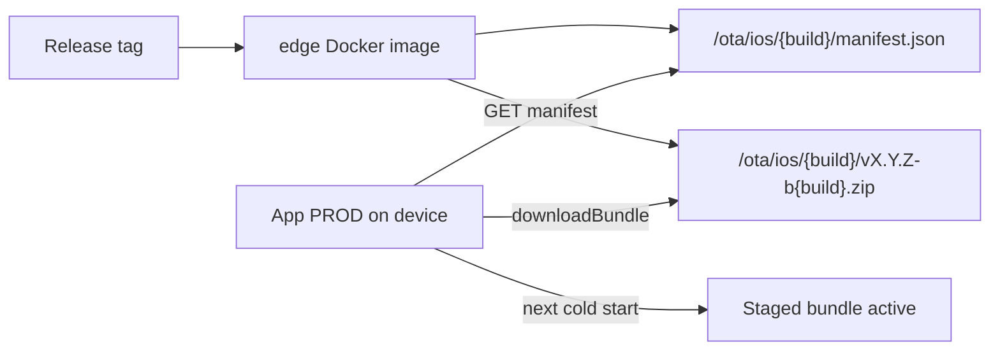

# Self-Hosted iOS Live Update (Capawesome, No Cloud)

Game Shelf ships **iOS web-layer updates** over the air without TestFlight when only
`src/**` (and other edge-scoped paths) change on a release tag. The native App PROD shell
downloads signed zip bundles from the production **edge** host.

No Capawesome Cloud account is required — only the MIT `@capawesome/capacitor-live-update`
plugin, RSA code signing, and static files on edge.

See also [`ios-testflight-ci.md`](ios-testflight-ci.md) for native-shell TestFlight gating.

## How it works



1. **Release & Publish** rebuilds the edge image when web sources change.
2. When TestFlight is **skipped** (no native-shell diff), CI also builds an **ios-prod** zip,
   signs it, and embeds it under `/ota/ios/` in the edge image.
3. On launch, App PROD fetches `/ota/ios/{CFBundleVersion}/manifest.json`, downloads a newer
   bundle if available, stages it, and applies it on the **next cold start**.
4. After Angular boots successfully, the app calls `LiveUpdate.ready()` so a broken bundle
   rolls back to the embedded default.

When **native-shell** files change on the same tag, OTA publish is skipped — TestFlight
embeds the fresh bundle instead (avoids build-number mismatch).

## One-time setup

### 1. RSA signing keys

Generate once locally (do **not** commit the private key):

```bash
mkdir -p ~/.config/game-shelf/ios
openssl genrsa -out ~/.config/game-shelf/ios/live-update-private.pem 2048
openssl rsa -in ~/.config/game-shelf/ios/live-update-private.pem \
  -pubout -out config/ios-live-update-public.pem
```

The **public** key is committed at [`config/ios-live-update-public.pem`](../config/ios-live-update-public.pem)
and loaded by [`capacitor.config.ts`](../capacitor.config.ts).

### 2. GitHub secrets and variables

| Name                          | Type     | Description                                                          |
| ----------------------------- | -------- | -------------------------------------------------------------------- |
| `IOS_LIVE_UPDATE_PRIVATE_KEY` | Secret   | Full PEM contents of the private key (used during edge Docker build) |
| `IOS_BACKEND_ORIGIN_PROD`     | Secret   | HTTPS prod origin (same as TestFlight / ios-prod builds)             |
| `IOS_OTA_NATIVE_BUILD_NUMBER` | Variable | Latest App PROD `CFBundleVersion` used for OTA manifest paths        |

After a successful **TestFlight** upload, CI auto-syncs `IOS_OTA_NATIVE_BUILD_NUMBER`
from the uploaded build number. Use manual `gh variable set IOS_OTA_NATIVE_BUILD_NUMBER …`
only for recovery if sync fails.

Rotating the OTA signing key requires a **TestFlight** release (`config/ios-live-update-public.pem`
is embedded in the native shell). OTA alone cannot deliver a new public key to devices.

### 3. Bootstrap TestFlight build

Adding the live-update plugin is a **native-shell change**. The first release that includes
this feature must upload TestFlight so devices have the plugin embedded. Subsequent src-only
releases use OTA only.

## Manifest format

Served at `https://<prod-host>/ota/ios/{nativeBuildNumber}/manifest.json`:

```json
{
  "bundleId": "v1.57.0-b42",
  "semver": "1.57.0",
  "nativeBuildNumber": "42",
  "url": "https://<prod-host>/ota/ios/42/v1.57.0-b42.zip",
  "checksum": "<sha256-hex>",
  "signature": "<rsa-sha256-base64>"
}
```

- `bundleId` must be unique per release (`v{semver}-b{build}`).
- `nativeBuildNumber` must match the device's `LiveUpdate.getVersionCode()`.
- `checksum` / `signature` verify the zip (RSA-SHA256 over full file bytes).

## Local development

Live update runs only when `isNativePlatform()` **and** `environment.production` (App PROD).

**Do not use live reload** when testing OTA — the dev server replaces the bundled web assets.

Reset to the embedded bundle:

```typescript
import { LiveUpdate } from '@capawesome/capacitor-live-update';

await LiveUpdate.reset();
// cold restart the app
```

Build artifacts locally:

```bash
export IOS_BACKEND_ORIGIN_PROD=https://your-prod-host
export IOS_OTA_NATIVE_BUILD_NUMBER=42
export IOS_LIVE_UPDATE_PRIVATE_KEY_PATH=~/.config/game-shelf/ios/live-update-private.pem

node scripts/build-ios-live-update-artifacts.mjs
# output under ota/ios/{build}/
```

Inspect deploy gating:

```bash
node scripts/ios-live-update-should-deploy.mjs --base v1.56.0 --head v1.57.0
```

## CI gating

| Path                                | TestFlight | OTA (edge `/ota`) |
| ----------------------------------- | ---------- | ----------------- |
| `src/**` only                       | Skip       | Publish           |
| Root web deps (`@angular/*`, etc.)  | Skip       | Publish           |
| `ios/**`, Capacitor deps            | Publish    | Skip (same tag)   |
| `config/ios-live-update-public.pem` | Publish    | Skip (same tag)   |
| Backend only                        | Skip       | Skip              |

Scripts:

- [`scripts/ios-testflight-should-deploy.mjs`](../scripts/ios-testflight-should-deploy.mjs)
- [`scripts/ios-live-update-should-deploy.mjs`](../scripts/ios-live-update-should-deploy.mjs)
- [`scripts/build-ios-live-update-artifacts.mjs`](../scripts/build-ios-live-update-artifacts.mjs)

## Troubleshooting

| Symptom                     | Likely cause                                                          |
| --------------------------- | --------------------------------------------------------------------- |
| No OTA on src-only tag      | Edge image not published; check Release & Publish summary             |
| Manifest 404                | `IOS_OTA_NATIVE_BUILD_NUMBER` does not match device build number      |
| Download fails signature    | Private key in CI does not match committed public key                 |
| App rolls back after update | Angular failed to boot within `readyTimeout` (10s) — check debug logs |
| Stale UI after release      | OTA applies on **next cold start** (kill app, reopen)                 |
| Dev app tries OTA           | Expected to skip — only App PROD (`environment.production`)           |

Debug events are logged via `DebugLogService` under keys prefixed with `live_update.`.

## Limitations

- Full zip download each release (no delta updates on self-hosted path).
- Cannot change native plugins, entitlements, or baked `IOS_BACKEND_ORIGIN_PROD` via OTA.
- App DEV (`gameshelf.dev`) is excluded from live update checks.
