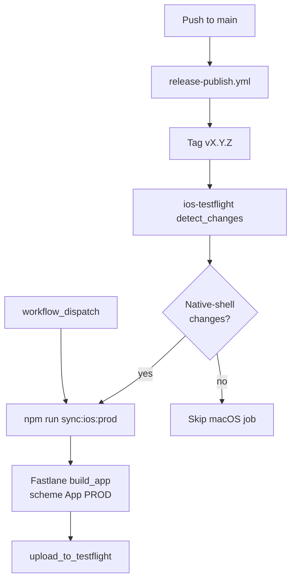

# iOS TestFlight CI

Game Shelf uploads the **App PROD** Capacitor build to TestFlight when the release workflow
pushes a semver tag (`v*`) **and** native-shell files changed since the previous tag.
Distribution is TestFlight-only — builds are not submitted to the public App Store.

## Pipeline overview



Workflow file: [`.github/workflows/ios-testflight.yml`](../.github/workflows/ios-testflight.yml)

Fastlane config: [`ios/fastlane/`](../ios/fastlane/)

## Triggers

| Trigger             | When                                                                                                                                                                |
| ------------------- | ------------------------------------------------------------------------------------------------------------------------------------------------------------------- |
| Tag push `v*`       | After `Release & Publish` pushes a tag, **only if native-shell paths changed** since the previous tag                                                               |
| `workflow_dispatch` | Manual override (always runs macOS build — use for signing retries or emergencies, not normal src-only fixes; those ship via [iOS live update](ios-live-update.md)) |

## Deploy gating (native shell only)

Tag pushes always start the workflow, but a cheap Ubuntu job diffs `prev_tag..current_tag`
before the macOS build. TestFlight runs only when native-shell files changed.

**Auto-deploy paths:**

| Path                                                                                                                                                                                                          | Why                                                                                                                             |
| ------------------------------------------------------------------------------------------------------------------------------------------------------------------------------------------------------------- | ------------------------------------------------------------------------------------------------------------------------------- |
| `ios/**`                                                                                                                                                                                                      | Xcode project, entitlements, plists, Fastlane                                                                                   |
| `config/ios-live-update-public.pem`                                                                                                                                                                           | OTA verification key embedded in native shell via `capacitor.config.ts`                                                         |
| `capacitor.config.ts`, `ionic.config.json`, `angular.json`                                                                                                                                                    | Capacitor / ios-prod build config                                                                                               |
| `scripts/write-environment-ios.mjs`, `scripts/bootstrap-ios-firebase-plists.mjs`, `scripts/generate-ios-info-plists.mjs`, `scripts/sync-ios-version.mjs`, `scripts/run-ios.mjs`, `scripts/ios-run-common.mjs` | iOS build and deploy scripts                                                                                                    |
| `.github/workflows/ios-testflight.yml`                                                                                                                                                                        | Pipeline itself                                                                                                                 |
| `package.json` / `package-lock.json`                                                                                                                                                                          | Only when `@capacitor/*`, `@capacitor-community/*`, `@capacitor-firebase/*`, `@capawesome/*`, `@ionic/*`, or `ionicons` changed |

**Does not auto-deploy:**

- `src/**` (bundled UI — delivered via **iOS live update** on edge when native shell unchanged; see [`ios-live-update.md`](ios-live-update.md))
- Backend / infra: `server/`, `worker/`, scrapers, `edge/`, Docker files
- Release noise: `CHANGELOG.md`, semver-only `package.json` bumps, marketing-only `project.pbxproj` bumps

Inspect locally:

```bash
node scripts/ios-testflight-should-deploy.mjs --base v1.55.0 --head v1.56.0
```

When a tag is skipped, the workflow writes an Actions summary explaining why. Run
**workflow_dispatch** to force a TestFlight upload without re-tagging (override only — src-only
releases normally use OTA on edge; see [`ios-live-update.md`](ios-live-update.md)).

Docker image publishing uses the same diff-since-previous-tag pattern in
[`release-publish.yml`](../.github/workflows/release-publish.yml) via
[`scripts/docker-publish-should-deploy.mjs`](../scripts/docker-publish-should-deploy.mjs).

## One-time GitHub setup

Configure these in the repository **production** environment (or repo-level secrets/vars if
you prefer):

### Secrets

| Name                              | Description                                                                                                            |
| --------------------------------- | ---------------------------------------------------------------------------------------------------------------------- |
| `APP_STORE_CONNECT_API_KEY_ID`    | App Store Connect API key ID                                                                                           |
| `APP_STORE_CONNECT_API_ISSUER_ID` | App Store Connect issuer ID                                                                                            |
| `APP_STORE_CONNECT_API_KEY`       | Base64-encoded `.p8` private key contents                                                                              |
| `IOS_FIREBASE_PROD_PLIST_BASE64`  | Base64-encoded prod `GoogleService-Info.plist` (same file as `~/.config/game-shelf/ios/GoogleService-Info.prod.plist`) |
| `IOS_BACKEND_ORIGIN_PROD`         | HTTPS production edge origin baked into `environment.ios.prod.ts` (same value as local `.env`)                         |

Encode the Firebase plist locally:

```bash
base64 -i ~/.config/game-shelf/ios/GoogleService-Info.prod.plist | pbcopy
```

Encode the App Store Connect API key:

```bash
base64 -i AuthKey_XXXXXXXXXX.p8 | pbcopy
```

### Variables

| Name                          | Description                                                                 |
| ----------------------------- | --------------------------------------------------------------------------- |
| `IOS_OTA_NATIVE_BUILD_NUMBER` | Latest App PROD `CFBundleVersion` used for OTA manifest paths (see OTA doc) |

## One-time Apple setup

1. Create an App Store Connect API key with **App Manager** (or Admin) access.
2. Ensure the key can manage **Certificates, Identifiers & Profiles** (required for
   automatic signing with `-allowProvisioningUpdates` on CI).
3. Create the App Store Connect app record (**Apps → + → New App**) with bundle ID
   `io.github.thetigeregg.gameshelf` on team `6V392K7X46` (must match
   [`ios/fastlane/Appfile`](../ios/fastlane/Appfile)).
4. Confirm the prod app ID `io.github.thetigeregg.gameshelf` has Push Notifications
   enabled (see [`App.prod.entitlements`](../ios/App/App/App.prod.entitlements)).

## What the workflow does

1. Checks out the tagged commit with full history.
2. Runs [`scripts/ios-testflight-should-deploy.mjs`](../scripts/ios-testflight-should-deploy.mjs) to compare native-shell changes since the previous semver tag (skipped on manual dispatch).
3. If gated off, writes a skip summary and exits without macOS minutes.
4. Otherwise installs Node and Ruby/Fastlane dependencies.
5. Decodes the Firebase prod plist into `IOS_FIREBASE_PROD_PLIST_PATH`.
6. Validates required secrets and runs `bundle exec fastlane validate_asc_app` to confirm
   the App Store Connect app exists before building.
7. Runs `bundle exec fastlane deploy_testflight` from `ios/`, which:
   - Reads semver from root [`package.json`](../package.json)
   - Queries App Store Connect for the latest TestFlight build number and increments it
   - Updates **App PROD** `MARKETING_VERSION` / `CURRENT_PROJECT_VERSION` in Xcode
   - Runs `npm run sync:ios:prod` (Angular ios-prod build + Capacitor sync)
   - Archives **App PROD** (Release) with automatic signing
   - Uploads to TestFlight (does not wait for Apple processing)

## Local debugging

iOS Fastlane tooling expects **Ruby 3.3** and **Bundler 2.5.x** (see [`ios/.ruby-version`](../ios/.ruby-version)).
Use a version manager (rbenv, asdf, mise) if your system Ruby is older.

Install Fastlane locally:

```bash
cd ios
gem install bundler -v 2.5.23
bundle _2.5.23_ install
```

Build without uploading (requires local signing setup):

```bash
export IOS_BACKEND_ORIGIN_PROD=https://your-prod-host
export IOS_BUILD_NUMBER=1
bundle exec fastlane build_only
```

Upload manually from a Mac with API key env vars set:

```bash
export APP_STORE_CONNECT_API_KEY_ID=...
export APP_STORE_CONNECT_API_ISSUER_ID=...
export APP_STORE_CONNECT_API_KEY=...   # base64 p8
export IOS_BACKEND_ORIGIN_PROD=https://your-prod-host
export IOS_FIREBASE_PROD_PLIST_PATH=/path/to/GoogleService-Info.prod.plist
bundle exec fastlane deploy_testflight
```

## Versioning

- **Marketing version** (`CFBundleShortVersionString`): repo-wide semver from `package.json`.
  The release workflow syncs all `MARKETING_VERSION` entries in `project.pbxproj` (App PROD and
  App DEV). `prebuild:ios` and Fastlane re-sync as a safety net before builds.
- **Build number** (`CFBundleVersion`): next integer after the latest TestFlight build in App
  Store Connect for `io.github.thetigeregg.gameshelf`. Set by Fastlane at TestFlight upload
  time only — not tied to `package.json`.

The helper [`scripts/sync-ios-version.mjs`](../scripts/sync-ios-version.mjs) supports:

- `--marketing-only` — update all `MARKETING_VERSION` entries from `package.json`
- `--build-number` — update App PROD `CURRENT_PROJECT_VERSION` (Fastlane / local archive)
- `--check` — verify pbxproj marketing versions match `package.json`

TestFlight gating ignores marketing-only `project.pbxproj` diffs so release version bumps do
not force a native rebuild when no other shell files changed.

## Troubleshooting

| Symptom                                            | Likely cause                                                                                            |
| -------------------------------------------------- | ------------------------------------------------------------------------------------------------------- |
| Could not find an app on App Store Connect         | ASC app record not created yet, or bundle ID / team mismatch vs `ios/fastlane/Appfile`                  |
| Missing Firebase plist                             | `IOS_FIREBASE_PROD_PLIST_BASE64` secret not set or invalid base64                                       |
| Missing backend origin                             | `IOS_BACKEND_ORIGIN_PROD` secret not set                                                                |
| Signing / provisioning failure                     | ASC API key lacks cert/profile access; first CI run may need Admin to approve profile creation          |
| Build number already used                          | Re-run after a previous upload completed; Fastlane queries ASC for the latest build number              |
| Wrong backend in app                               | `IOS_BACKEND_ORIGIN_PROD` does not match production edge URL                                            |
| Tag pushed but no TestFlight build                 | Expected when only backend/src changed; run workflow_dispatch to force a build                          |
| `ENOENT .../ios/fastlane/ios/App/...`              | `sync-ios-version.mjs` resolved paths from fastlane cwd; fixed by repo-root defaults                    |
| Setup Ruby fails with `undefined method 'untaint'` | Stale `BUNDLED WITH 1.x` in `ios/Gemfile.lock`; regenerate with `bundle _2.5.23_ lock --update-bundler` |

See also [`ios-multi-environment.md`](ios-multi-environment.md) for local dev/prod side-by-side
setup and [`notifications-troubleshooting.md`](notifications-troubleshooting.md) for push
debugging.
