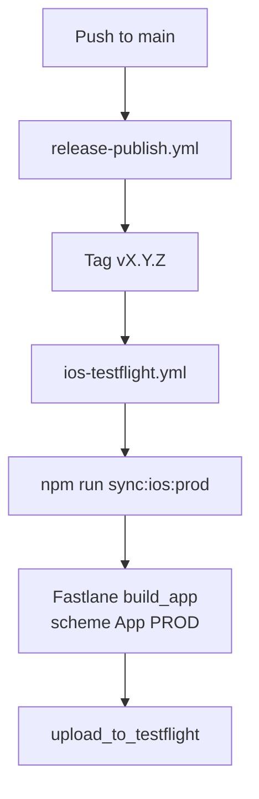

# iOS TestFlight CI

Game Shelf uploads the **App PROD** Capacitor build to TestFlight automatically when the
release workflow pushes a semver tag (`v*`). Distribution is TestFlight-only — builds are
not submitted to the public App Store.

## Pipeline overview



Workflow file: [`.github/workflows/ios-testflight.yml`](../.github/workflows/ios-testflight.yml)

Fastlane config: [`ios/fastlane/`](../ios/fastlane/)

## Triggers

| Trigger             | When                                                             |
| ------------------- | ---------------------------------------------------------------- |
| Tag push `v*`       | After `Release & Publish` bumps version and pushes a tag         |
| `workflow_dispatch` | Manual re-run (e.g. signing/provisioning fix without re-tagging) |

## One-time GitHub setup

Configure these in the repository **production** environment (or repo-level secrets/vars if
you prefer):

### Secrets

| Name                              | Description                                                                                                            |
| --------------------------------- | ---------------------------------------------------------------------------------------------------------------------- |
| `APP_STORE_CONNECT_API_KEY_ID`    | App Store Connect API key ID                                                                                           |
| `APP_STORE_CONNECT_API_ISSUER_ID` | App Store Connect issuer ID                                                                                            |
| `APP_STORE_CONNECT_API_KEY`       | Base64-encoded `.p8` private key contents                                                                              |
| `IOS_FIREBASE_PROD_PLIST_BASE64`  | Base64-encoded prod `GoogleService-Info.plist` (same file as `~/.config/game-shelf/ios/GoogleService-Info.prod.plist`) |

Encode the Firebase plist locally:

```bash
base64 -i ~/.config/game-shelf/ios/GoogleService-Info.prod.plist | pbcopy
```

Encode the App Store Connect API key:

```bash
base64 -i AuthKey_XXXXXXXXXX.p8 | pbcopy
```

### Variables

| Name                      | Description                                                                                    |
| ------------------------- | ---------------------------------------------------------------------------------------------- |
| `IOS_BACKEND_ORIGIN_PROD` | HTTPS production edge origin baked into `environment.ios.prod.ts` (same value as local `.env`) |

## One-time Apple setup

1. Create an App Store Connect API key with **App Manager** (or Admin) access.
2. Ensure the key can manage **Certificates, Identifiers & Profiles** (required for
   automatic signing with `-allowProvisioningUpdates` on CI).
3. Confirm the prod app ID `io.github.thetigeregg.gameshelf` has Push Notifications
   enabled (see [`App.prod.entitlements`](../ios/App/App/App.prod.entitlements)).

## What the workflow does

1. Checks out the tagged commit.
2. Installs Node and Ruby/Fastlane dependencies.
3. Decodes the Firebase prod plist into `IOS_FIREBASE_PROD_PLIST_PATH`.
4. Runs `bundle exec fastlane testflight` from `ios/`, which:
   - Reads semver from root [`package.json`](../package.json)
   - Queries App Store Connect for the latest TestFlight build number and increments it
   - Updates **App PROD** `MARKETING_VERSION` / `CURRENT_PROJECT_VERSION` in Xcode
   - Runs `npm run sync:ios:prod` (Angular ios-prod build + Capacitor sync)
   - Archives **App PROD** (Release) with automatic signing
   - Uploads to TestFlight (does not wait for Apple processing)

## Local debugging

Install Fastlane locally:

```bash
cd ios
bundle install
```

Build without uploading (requires local signing setup):

```bash
export IOS_BACKEND_ORIGIN_PROD=https://your-prod-host
export IOS_BUILD_NUMBER=1
bundle exec fastlane build_only
```

Upload manually from a Mac with API key env vars set:

```bash
export APP_STORE_CONNECT_API_KEY_ID=...
export APP_STORE_CONNECT_API_ISSUER_ID=...
export APP_STORE_CONNECT_API_KEY=...   # base64 p8
export IOS_BACKEND_ORIGIN_PROD=https://your-prod-host
export IOS_FIREBASE_PROD_PLIST_PATH=/path/to/GoogleService-Info.prod.plist
bundle exec fastlane testflight
```

## Versioning

- **Marketing version** (`CFBundleShortVersionString`): repo-wide semver from `package.json`
  at tag time.
- **Build number** (`CFBundleVersion`): next integer after the latest TestFlight build in App
  Store Connect for `io.github.thetigeregg.gameshelf`.

The helper [`scripts/sync-ios-version.mjs`](../scripts/sync-ios-version.mjs) updates only
**App PROD** build settings (not App DEV).

## Troubleshooting

| Symptom                        | Likely cause                                                                                   |
| ------------------------------ | ---------------------------------------------------------------------------------------------- |
| Missing Firebase plist         | `IOS_FIREBASE_PROD_PLIST_BASE64` secret not set or invalid base64                              |
| Missing backend origin         | `IOS_BACKEND_ORIGIN_PROD` variable not set                                                     |
| Signing / provisioning failure | ASC API key lacks cert/profile access; first CI run may need Admin to approve profile creation |
| Build number already used      | Re-run after a previous upload completed; Fastlane queries ASC for the latest build number     |
| Wrong backend in app           | `IOS_BACKEND_ORIGIN_PROD` does not match production edge URL                                   |

See also [`ios-multi-environment.md`](ios-multi-environment.md) for local dev/prod side-by-side
setup and [`notifications-troubleshooting.md`](notifications-troubleshooting.md) for push
debugging.
