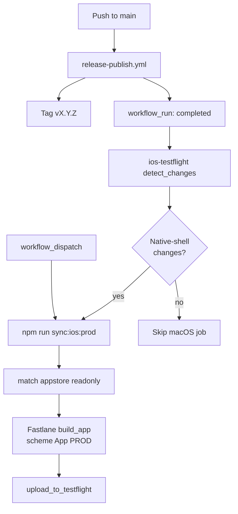

# iOS TestFlight CI

Game Shelf uploads the **App PROD** Capacitor build to TestFlight when the release workflow
completes successfully **and** native-shell files changed since the previous tag.
Distribution is TestFlight-only — builds are not submitted to the public App Store.

## Pipeline overview



Workflow file: [`.github/workflows/ios-testflight.yml`](../.github/workflows/ios-testflight.yml)

Fastlane config: [`ios/fastlane/`](../ios/fastlane/)

Signing uses **fastlane match** with an encrypted private repo
[`thetigeregg/game-shelf-match-certs`](https://github.com/thetigeregg/game-shelf-match-certs)
(Apple Distribution certificate + App Store profile). CI installs them into a temporary
keychain before archive/export — similar to Azure DevOps secure files for certs/profiles.

## Triggers

| Trigger             | When                                                                                                                                                                                                                                                                                                   |
| ------------------- | ------------------------------------------------------------------------------------------------------------------------------------------------------------------------------------------------------------------------------------------------------------------------------------------------------ |
| `workflow_run`      | Fires when `Release & Publish` completes on `main` (any conclusion); `detect_changes`, `skip_summary`, and `testflight` jobs run only when conclusion is `success` (job-level `if` guard) — bypasses `[skip ci]` on the release commit — **only if native-shell paths changed** since the previous tag |
| `workflow_dispatch` | Manual override (always runs macOS build — use for signing retries or emergencies, not normal src-only fixes; those ship via [iOS live update](ios-live-update.md))                                                                                                                                    |

## Deploy gating (native shell only)

`workflow_run` completion always starts the workflow (bypassing `[skip ci]`), but a cheap Ubuntu
job diffs `prev_tag..current_tag` before the macOS build. TestFlight runs only when native-shell
files changed. The `detect_changes` checkout is pinned to `github.event.workflow_run.head_sha` (falling back to `github.sha` for `workflow_dispatch`). Tag resolution uses `git tag --list 'v*' --sort=-v:refname | head -1` to select the latest `v*` tag from all fetched refs — this correctly resolves the release tag even when it was pushed on a bump commit after the upstream `head_sha`. If no tag is found, the workflow deploys unconditionally using the upstream SHA without resolving a `release_tag`. The `testflight` checkout similarly uses `release_tag` when resolved, then `github.event.workflow_run.head_sha`, then `github.sha` as a last resort.

**Auto-deploy paths:**

| Path                                                                                                                                                                                                          | Why                                                                                                                             |
| ------------------------------------------------------------------------------------------------------------------------------------------------------------------------------------------------------------- | ------------------------------------------------------------------------------------------------------------------------------- |
| `ios/**`                                                                                                                                                                                                      | Xcode project, entitlements, plists, Fastlane                                                                                   |
| `config/ios-live-update-public.pem`                                                                                                                                                                           | OTA verification key embedded in native shell via `capacitor.config.ts`                                                         |
| `capacitor.config.ts`, `ionic.config.json`, `angular.json`                                                                                                                                                    | Capacitor / ios-prod build config                                                                                               |
| `scripts/write-environment-ios.mjs`, `scripts/bootstrap-ios-firebase-plists.mjs`, `scripts/generate-ios-info-plists.mjs`, `scripts/sync-ios-version.mjs`, `scripts/run-ios.mjs`, `scripts/ios-run-common.mjs` | iOS build and deploy scripts                                                                                                    |
| `.github/workflows/ios-testflight.yml`                                                                                                                                                                        | Pipeline itself                                                                                                                 |
| `package.json` / `package-lock.json`                                                                                                                                                                          | Only when `@capacitor/*`, `@capacitor-community/*`, `@capacitor-firebase/*`, `@capawesome/*`, `@ionic/*`, or `ionicons` changed |

**Does not auto-deploy:**

- `src/**` (bundled UI — delivered via **iOS live update** on edge when native shell unchanged; see [`ios-live-update.md`](ios-live-update.md))
- Backend / infra: `server/`, `worker/`, scrapers, `edge/`, Docker files
- Release noise: `CHANGELOG.md`, semver-only `package.json` bumps, marketing-only `project.pbxproj` bumps

Inspect locally:

```bash
node scripts/ios-testflight-should-deploy.mjs --base v1.55.0 --head v1.56.0
```

When a tag is skipped, the workflow writes an Actions summary explaining why. Run
**workflow_dispatch** to force a TestFlight upload without re-tagging (override only — src-only
releases normally use OTA on edge; see [`ios-live-update.md`](ios-live-update.md)).

Docker image publishing uses the same diff-since-previous-tag pattern in
[`release-publish.yml`](../.github/workflows/release-publish.yml) via
[`scripts/docker-publish-should-deploy.mjs`](../scripts/docker-publish-should-deploy.mjs).

## One-time GitHub setup

Configure these in the repository **production** environment (or repo-level secrets/vars if
you prefer):

### Secrets

| Name                              | Description                                                                                                            |
| --------------------------------- | ---------------------------------------------------------------------------------------------------------------------- |
| `APP_STORE_CONNECT_API_KEY_ID`    | App Store Connect API key ID                                                                                           |
| `APP_STORE_CONNECT_API_ISSUER_ID` | App Store Connect issuer ID                                                                                            |
| `APP_STORE_CONNECT_API_KEY`       | Base64-encoded `.p8` private key contents                                                                              |
| `MATCH_PASSWORD`                  | Passphrase that encrypts cert/profile files in the match repo                                                          |
| `MATCH_GIT_BASIC_AUTHORIZATION`   | Base64 of `x-access-token:<PAT>` for read access to `game-shelf-match-certs`                                           |
| `IOS_FIREBASE_PROD_PLIST_BASE64`  | Base64-encoded prod `GoogleService-Info.plist` (same file as `~/.config/game-shelf/ios/GoogleService-Info.prod.plist`) |
| `IOS_BACKEND_ORIGIN_PROD`         | HTTPS production edge origin baked into `environment.ios.prod.ts` (same value as local `.env`)                         |
| `AUTOCOMMIT_APP_PRIVATE_KEY`      | GitHub App private key (PEM) used to mint a token that can update repository variables after TestFlight upload         |

Encode the Firebase plist locally:

```bash
base64 -i ~/.config/game-shelf/ios/GoogleService-Info.prod.plist | pbcopy
```

Encode the App Store Connect API key:

```bash
base64 -i AuthKey_XXXXXXXXXX.p8 | pbcopy
```

Encode match git auth (fine-grained PAT with repo access to `game-shelf-match-certs`):

```bash
echo -n 'x-access-token:github_pat_xxxxxxxx' | base64 | pbcopy
```

### Variables

| Name                          | Description                                                                 |
| ----------------------------- | --------------------------------------------------------------------------- |
| `AUTOCOMMIT_CLIENT_ID`        | GitHub App **Client ID** (from app settings; not the numeric App ID)        |
| `IOS_OTA_NATIVE_BUILD_NUMBER` | Latest App PROD `CFBundleVersion` used for OTA manifest paths (see OTA doc) |

## One-time Apple setup

1. Create an App Store Connect API key with **App Manager** (or Admin) access.
2. Create the App Store Connect app record (**Apps → + → New App**) with bundle ID
   `io.github.thetigeregg.gameshelf` on team `6V392K7X46` (must match
   [`ios/fastlane/Appfile`](../ios/fastlane/Appfile)).
3. In the **Developer** portal, keep the App ID `io.github.thetigeregg.gameshelf` with
   **Push Notifications** enabled (see [`App.prod.entitlements`](../ios/App/App/App.prod.entitlements)).
4. **Revoke** any manually created iOS Distribution certificate and App Store profile for
   this bundle ID before bootstrapping match (match will recreate them).
5. Do **not** create new distribution certs or App Store profiles manually after match is
   bootstrapped — let match manage them.

## One-time match bootstrap (local Mac)

Create a private empty repo `thetigeregg/game-shelf-match-certs`, add GitHub secrets above,
then run once on a Mac:

```bash
cd ios
gem install bundler -v 2.5.23
bundle _2.5.23_ install

export MATCH_PASSWORD='...'
export MATCH_GIT_BASIC_AUTHORIZATION='...'   # base64 x-access-token:PAT
export APP_STORE_CONNECT_API_KEY_ID='...'
export APP_STORE_CONNECT_API_ISSUER_ID='...'
export APP_STORE_CONNECT_API_KEY='...'     # base64 p8

bundle exec fastlane match appstore
```

Match creates an Apple Distribution certificate and App Store profile for
`io.github.thetigeregg.gameshelf`, encrypts them, and pushes to the private repo.

Verify in the Developer portal:

- **Certificates**: iOS Distribution entry
- **Profiles**: App Store profile named `match AppStore io.github.thetigeregg.gameshelf`

## What the workflow does

1. Checks out the tagged commit with full history.
2. Runs [`scripts/ios-testflight-should-deploy.mjs`](../scripts/ios-testflight-should-deploy.mjs) to compare native-shell changes since the previous semver tag (skipped on manual dispatch).
3. If gated off, writes a skip summary and exits without macOS minutes.
4. Otherwise installs Node and Ruby/Fastlane dependencies.
5. Decodes the Firebase prod plist into `IOS_FIREBASE_PROD_PLIST_PATH`.
6. Validates required secrets, runs `bundle exec fastlane validate_asc_app`, then
   `bundle exec fastlane validate_match` (readonly install of cert + profile).
7. Runs `bundle exec fastlane deploy_testflight` from `ios/`, which:
   - Reads semver from root [`package.json`](../package.json)
   - Queries App Store Connect for the latest TestFlight build number and increments it
   - Updates **App PROD** `MARKETING_VERSION` / `CURRENT_PROJECT_VERSION` in Xcode
   - Runs `match appstore` (readonly on CI) to install signing assets, then applies manual
     signing settings for the **App PROD** target
   - Runs `npm run sync:ios:prod` (Angular ios-prod build + Capacitor sync)
   - Archives and exports **App PROD** (Release) with the match App Store profile
   - Uploads to TestFlight with `uses_non_exempt_encryption: false` (does not wait for Apple
     processing)
8. Mints a GitHub App token and sets `IOS_OTA_NATIVE_BUILD_NUMBER` to the uploaded native build
   number so edge OTA manifests stay aligned with the latest TestFlight shell.

## Native dependencies

`@capacitor-firebase/messaging` requires the `firebase` npm package as a peer dependency
for ios-prod bundling (its web shim imports `firebase/messaging`). Web and Docker builds use
a stub in [`firebase-messaging.client.ts`](../src/app/core/services/firebase-messaging.client.ts)
instead; ios-prod swaps in the native plugin via [`angular.json`](../angular.json)
`fileReplacements`.

PR CI validates the ios-prod Angular build on Ubuntu via
[`ci-pr.yml`](../.github/workflows/ci-pr.yml) (`ios_prod_build_validation` job) using the
fixture plist at [`test/fixtures/ios/GoogleService-Info.prod.plist`](../test/fixtures/ios/GoogleService-Info.prod.plist).

## Local debugging

iOS Fastlane tooling expects **Ruby 3.3** and **Bundler 2.5.x** (see [`ios/.ruby-version`](../ios/.ruby-version)).
Use a version manager (rbenv, asdf, mise) if your system Ruby is older.

Install Fastlane locally:

```bash
cd ios
gem install bundler -v 2.5.23
bundle _2.5.23_ install
```

Build without uploading (requires match bootstrap and env vars):

```bash
export MATCH_PASSWORD=...
export MATCH_GIT_BASIC_AUTHORIZATION=...   # or use SSH/git credential helper locally
export APP_STORE_CONNECT_API_KEY_ID=...
export APP_STORE_CONNECT_API_ISSUER_ID=...
export APP_STORE_CONNECT_API_KEY=...     # base64 p8
export IOS_BACKEND_ORIGIN_PROD=https://your-prod-host
export IOS_FIREBASE_PROD_PLIST_PATH=/path/to/GoogleService-Info.prod.plist
export IOS_BUILD_NUMBER=1
bundle exec fastlane build_only
```

Upload manually from a Mac with all env vars set:

```bash
bundle exec fastlane deploy_testflight
```

## Versioning

- **Marketing version** (`CFBundleShortVersionString`): repo-wide semver from `package.json`.
  The release workflow syncs all `MARKETING_VERSION` entries in `project.pbxproj` (App PROD and
  App DEV). `prebuild:ios` and Fastlane re-sync as a safety net before builds.
- **Build number** (`CFBundleVersion`): next integer after the latest TestFlight build in App
  Store Connect for `io.github.thetigeregg.gameshelf`. Set by Fastlane at TestFlight upload
  time only — not tied to `package.json`.

The helper [`scripts/sync-ios-version.mjs`](../scripts/sync-ios-version.mjs) supports:

- `--marketing-only` — update all `MARKETING_VERSION` entries from `package.json`
- `--build-number` — update App PROD `CURRENT_PROJECT_VERSION` (Fastlane / local archive)
- `--check` — verify pbxproj marketing versions match `package.json`

TestFlight gating ignores marketing-only `project.pbxproj` diffs so release version bumps do
not force a native rebuild when no other shell files changed.

## Match maintenance

| Task                                             | Command                                                            |
| ------------------------------------------------ | ------------------------------------------------------------------ |
| Distribution cert expired (~1 year)              | `bundle exec fastlane match appstore --force_for_new_certificates` |
| App ID capability changed (e.g. new entitlement) | `bundle exec fastlane match appstore --force`                      |
| CI cannot clone certs repo                       | Verify `MATCH_GIT_BASIC_AUTHORIZATION` PAT has repo read access    |
| Wrong passphrase                                 | `MATCH_PASSWORD` must match the value used at bootstrap            |

After renewal, commit to the match repo is automatic; no workflow changes needed.

## Troubleshooting

| Symptom                                            | Likely cause                                                                                                                                                                                                                                                                |
| -------------------------------------------------- | --------------------------------------------------------------------------------------------------------------------------------------------------------------------------------------------------------------------------------------------------------------------------- |
| Could not find an app on App Store Connect         | ASC app record not created yet, or bundle ID / team mismatch vs `ios/fastlane/Appfile`                                                                                                                                                                                      |
| Missing Firebase plist                             | `IOS_FIREBASE_PROD_PLIST_BASE64` secret not set or invalid base64                                                                                                                                                                                                           |
| Missing backend origin                             | `IOS_BACKEND_ORIGIN_PROD` secret not set                                                                                                                                                                                                                                    |
| `validate_match` fails / cannot clone match repo   | `MATCH_GIT_BASIC_AUTHORIZATION` or `MATCH_PASSWORD` missing or wrong; PAT lacks repo access                                                                                                                                                                                 |
| `No signing certificate "iOS Distribution" found`  | Match not bootstrapped — run `fastlane match appstore` locally first                                                                                                                                                                                                        |
| `No profile for io.github.thetigeregg.gameshelf`   | Match profile missing or name mismatch; re-run `match appstore`                                                                                                                                                                                                             |
| Export fails after manual portal cert changes      | Revoke manual certs/profiles and let match regenerate; avoid mixing manual + match                                                                                                                                                                                          |
| Build number already used                          | Re-run after a previous upload completed; Fastlane queries ASC for the latest build number                                                                                                                                                                                  |
| Wrong backend in app                               | `IOS_BACKEND_ORIGIN_PROD` does not match production edge URL                                                                                                                                                                                                                |
| Release published but no TestFlight build          | Expected when only backend/src changed; run workflow_dispatch to force a build. Also confirm `Release & Publish` concluded `success` — `workflow_run` fires on any completion but jobs are skipped via the `if: conclusion == 'success'` guard when the upstream run failed |
| `ENOENT .../ios/fastlane/ios/App/...`              | `sync-ios-version.mjs` resolved paths from fastlane cwd; fixed by repo-root defaults                                                                                                                                                                                        |
| Setup Ruby fails with `undefined method 'untaint'` | Stale `BUNDLED WITH 1.x` in `ios/Gemfile.lock`; regenerate with `bundle _2.5.23_ lock --update-bundler`                                                                                                                                                                     |

See also [`ios-multi-environment.md`](ios-multi-environment.md) for local dev/prod side-by-side
setup and [`notifications-troubleshooting.md`](notifications-troubleshooting.md) for push
debugging.
